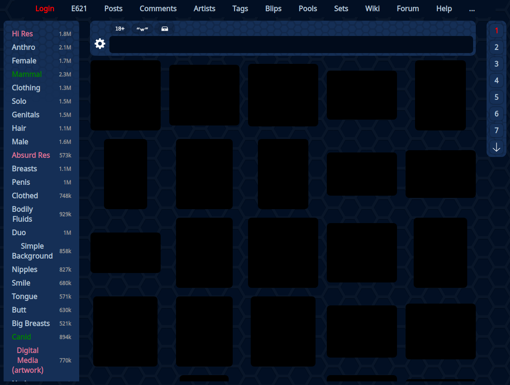

 

[![Badge Stoat]][Stoat]   
[![Badge Downloads]][Releases]   
[![Badge Commits]][Source]

#  Neko

[Ungoogled Chromium] browser extension  
that redesigns the interface of ***E621*** */* ***E926***.

 

[![Button Download]][Releases]   
[![Button Changelog]][Changelog]

[![Button Source]][Source]   
[![Button Public]][Public]

 

 
 

## Manifest V2

 

As **Google** has killed off **Manifest Version 2** it the effectiveness of most  
**Content Blocks** like **UBlock Origin**, it also forced all extension authors  
to switch to it if they wanted to stay on the **Chrome Extension Store**.

**Neko** is now focused on [Ungoogled Chromium] only  
as it ships with a patch that reverses the MV2 removal.

<!----------------------------------------------------------------------------->

[Ungoogled Chromium]: https://github.com/ungoogled-software/ungoogled-chromium
[Changelog]: https://github.com/LewdTechnologies/Neko/tree/Changelog
[Releases]: https://github.com/LewdTechnologies/Neko/releases
[Public]: https://github.com/LewdTechnologies/Neko/tree/Version
[Source]: https://github.com/LewdTechnologies/Neko/tree/Source
[Stoat]: https://stt.gg/Q0fkydAc

<!---------------------------------[ Badges ]---------------------------------->

[Badge Downloads]: https://img.shields.io/github/downloads/LewdTechnologies/Neko/total?style=for-the-badge&labelColor=319795&color=236c6a&logoColor=white&logo=GoogleAnalytics
[Badge Commits]: https://img.shields.io/github/commit-activity/m/LewdTechnologies/Neko/Source?color=00679e&labelColor=007ec6&label=Commits&logo=Git%20LFS&logoColor=white&style=for-the-badge
[Badge Stoat]: https://img.shields.io/badge/Discord-322b47?logo=Discord&logoColor=white&style=for-the-badge&labelColor=262136

<!---------------------------------[ Buttons ]--------------------------------->

[Button Changelog]: https://img.shields.io/badge/Changelog-A9225C?style=for-the-badge&logoColor=white&logo=BookStack
[Button Download]: https://img.shields.io/badge/Download-37814A?style=for-the-badge&logoColor=white&logo=AirplayVideo
[Button Source]: https://img.shields.io/badge/Source_Code-3584E3?style=for-the-badge&logoColor=white&logo=GitHub
[Button Public]: https://img.shields.io/badge/Public_Data-26689A?style=for-the-badge&logoColor=white&logo=AddThis
